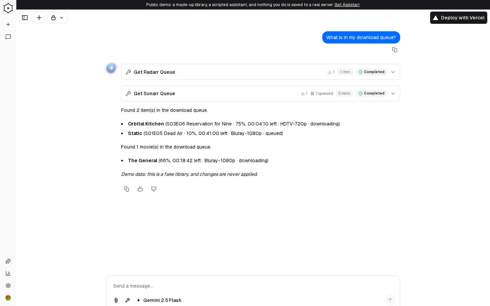

# Assistarr

Chat with your self-hosted media stack. Ask in plain language and Assistarr calls real Radarr, Sonarr, Jellyfin, Jellyseerr and qBittorrent tools, shows what they did, and asks before it changes anything.

**[Live demo](https://assistarr.vercel.app)** (a made-up library and a scripted assistant, nothing is saved) | **[Docs](https://alliecatowo.github.io/assistarr/)** | [Self-hosting](./SELF_HOSTING.md)

<picture>
  <source media="(prefers-color-scheme: dark)" srcset="docs/public/screens/chat-dark.png">
  
</picture>

## Features

- **Conversational Interface** - Chat naturally with your media server. Ask questions, request movies, manage downloads.
- **Multi-Provider AI** - Supports OpenAI, Anthropic, and Google AI models via Vercel AI SDK
- **Deep Service Integration** - First-class support for the *arr stack and media servers
- **Real-time Updates** - Streaming responses with tool execution feedback
- **Per-User Configuration** - Each user can configure their own service connections
- **Modern Stack** - Built on Next.js 16, React 19, and Tailwind CSS 4

## Integrations

| Service | Capabilities |
|---------|-------------|
| **Radarr** | Search movies, add to library, manage quality profiles, view queue, manual imports, history, blocklist |
| **Sonarr** | Search shows, add series, monitor episodes, view queue, manual imports, history, blocklist |
| **Jellyfin** | Browse libraries, search media, get playback info, user statistics |
| **Jellyseerr** | Search requests, submit new requests, check request status |
| **qBittorrent** | View active torrents, manage downloads, pause/resume transfers |

## Installation

### Prerequisites

- Node.js 24+ (Docker image uses Node 26)
- pnpm 9+
- PostgreSQL 16+
- At least one AI provider API key (OpenAI, Anthropic, or Google)

### Quick Start

```bash
# Clone the repository
git clone https://github.com/alliecatowo/assistarr.git
cd assistarr

# One-step setup: copy .env.example → .env.local + install deps
make setup

# Edit .env.local with your values, then:
make db-migrate   # Run database migrations
make dev          # Start the development server
```

Or step by step with pnpm:

```bash
pnpm install
cp .env.example .env.local   # then fill in values
pnpm db:migrate
pnpm dev
```

Open [http://localhost:3000](http://localhost:3000) to access the application.

### Docker Compose (recommended for self-hosting)

See [SELF_HOSTING.md](./SELF_HOSTING.md) for the full guide. Quick start:

```bash
cp .env.example .env
# Set POSTGRES_PASSWORD, AUTH_SECRET, and OPENROUTER_API_KEY
docker compose up -d
```

For development with hot reload:

```bash
docker compose -f docker-compose.yml -f docker-compose.dev.yml up
# or: make dev-docker
```

## Configuration

### Environment Variables

Copy `.env.example` to `.env.local` (local dev) or `.env` (Docker) and fill in your values.
See [`.env.example`](./.env.example) for full documentation of all variables.

**Required:**

| Variable | Description |
|---|---|
| `POSTGRES_URL` | PostgreSQL connection string |
| `AUTH_SECRET` | Session encryption secret (`openssl rand -base64 32`) |
| `OPENROUTER_API_KEY` **or** `AI_GATEWAY_API_KEY` | At least one AI provider key |

**Optional:**

| Variable | Description |
|---|---|
| `ENCRYPTION_KEY` | Encrypts service credentials in the DB (`openssl rand -base64 32`) |
| `REDIS_URL` | Enables resumable AI streams |
| `NEXTAUTH_URL` | Override if not running on `localhost:3000` |

Run `make check-env` to verify your configuration before starting.

### Service Configuration

After logging in, navigate to **Settings** to configure your media services:

1. **Radarr/Sonarr**: Enter your server URL and API key
2. **Jellyfin**: Provide your server URL and authentication token
3. **Jellyseerr**: Add your server URL and API key
4. **qBittorrent**: Configure WebUI URL and credentials

## Development

### Project Structure

```
app/
├── (auth)/              # Authentication pages
├── (chat)/              # Chat interface & API
└── (settings)/          # User settings
components/
├── elements/            # Reusable UI elements
└── message.tsx          # Chat message rendering
lib/
├── ai/
│   ├── prompts.ts       # System prompts
│   ├── providers.ts     # AI model configuration
│   └── plugins/         # Service integrations
└── db/                  # Database schema & queries
```

### Commands

All commands available via `make` (run `make help` for full list) or `pnpm` directly:

```bash
# Dev
make dev              # pnpm dev — start Next.js with Turbo
make dev-docker       # docker compose with hot reload
make setup            # first-time setup (copy .env.example + install)
make check-env        # verify required env vars

# Build
make build            # pnpm build
make start            # pnpm start

# Code quality
make lint             # biome linter
make format           # biome formatter

# Database
make db-migrate       # pnpm db:migrate — run pending migrations
make db-generate      # pnpm db:generate — generate from schema changes
make db-studio        # pnpm db:studio — open Drizzle Studio GUI
make db-push          # pnpm db:push — push schema (dev only)

# Testing
make test             # run all tests
make test-unit        # vitest unit tests
make test-e2e         # playwright end-to-end tests
make test-coverage    # tests with coverage report

# Health
make health           # curl /api/health (requires running server)
```

### Adding a New Service Integration

1. Create a new folder in `lib/plugins/{service-name}/`
2. Add the required files:
   - `client.ts` - API client with authentication
   - `types.ts` - TypeScript type definitions
   - `definition.ts` - Tool definitions for the AI
   - Individual tool files (`search.ts`, `add.ts`, etc.)
   - `index.ts` - Export aggregator
3. Register the service in `lib/plugins/registry.ts`
4. Add display names in `components/message.tsx`

## Tech Stack

| Category | Technology |
|----------|------------|
| **Framework** | [Next.js 16](https://nextjs.org/) (App Router) |
| **AI** | [Vercel AI SDK](https://sdk.vercel.ai/) |
| **Database** | [PostgreSQL](https://www.postgresql.org/) + [Drizzle ORM](https://orm.drizzle.team/) |
| **Auth** | [NextAuth.js](https://next-auth.js.org/) |
| **Styling** | [Tailwind CSS](https://tailwindcss.com/) + [shadcn/ui](https://ui.shadcn.com/) |
| **Animation** | [Framer Motion](https://www.framer.com/motion/) |

## License

This project is licensed under the Apache License 2.0 - see the [LICENSE](LICENSE) file for details.

---

<p align="center">
  Built with care for the self-hosted media community
</p>
